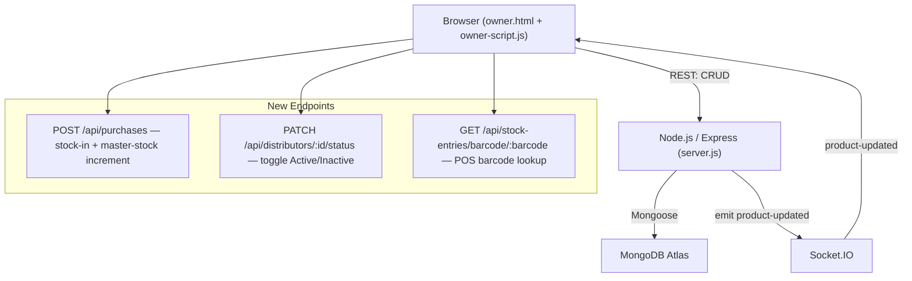

# Design Document — Dealer/Distributor Management

## Overview

This document describes the technical design for adding Dealer Management, Dealer Purchase Entry, Purchase History, Barcode Integration in the POS, and a Stock Synchronisation fix to the existing Jivi Mobiles Owner Portal.

The work is entirely additive. No existing MongoDB schemas, API routes, or client data-load functions are deleted. Four legacy nav items are swapped for four new ones; all existing page routes remain routable. The central theme across every change is **single source of truth**: `Product.stock` in MongoDB is the only authoritative stock number, `productsCache` on the server must never serve a stale value after a stock-changing operation, and `this.products` in the SPA must reflect the latest value pushed via Socket.IO.

### Design Decisions

1. **Reuse existing schemas without modification.** `Distributor`, `StockEntry`, and `StockMovement` already exist in `server.js` with correct field names. Adding new fields would risk migration issues; all new UI simply maps to existing fields.
2. **No new npm packages.** The only new runtime behaviour on the server is a missing `PATCH /api/distributors/:distributorId/status` endpoint and the `POST /api/purchases` master-stock increment (which already partially exists). The barcode-print path reuses the existing `printUnifiedThermalLabel` client-side function and the `POST /api/print-label` TSPL endpoint.
3. **Cache invalidation is synchronous, not eventual.** `productsCache = null; cacheTimestamp = 0;` is set *before* `io.emit('product-updated')` so that any client that immediately calls `GET /api/products` after receiving the event gets a fresh DB read, not a stale cache hit.
4. **Client-side stock update via Socket.IO only (no optimistic updates).** `this.products[i].stock` is mutated only when a `product-updated` event arrives, never speculatively on the client before the server confirms.

---

## Architecture

The system is a vanilla-JS single-page application (SPA) communicating with a Node.js/Express REST API backed by MongoDB Atlas. Real-time events flow over Socket.IO.



### Key Architectural Constraints

- **No new npm dependencies** — existing `express`, `mongoose`, `cors`, `socket.io`, and `crypto` are sufficient.
- **SPA routing** — `renderPage(pageName)` is the single dispatch function; new pages register as `case` branches inside it.
- **Event delegation** — the existing `app.addEventListener('click', ...)` pattern is extended, not bypassed.

---

## Components and Interfaces

### 1. Navigation Restructure (`owner-script.js` — `renderPage` / nav HTML)

The navigation bar is rendered inline inside the authenticated page shell. The four legacy items and their `data-page` values are replaced as follows:

| Removed | Replacement |
|---|---|
| `📊 Full Stock` → `admin-full-stock` | `📦 Stock Inventory` → `admin-stock-inventory` |
| `🤝 Distributors` → `admin-distributors` | `🏪 Dealers` → `admin-dealers` |
| `📥 Purchases` → `admin-purchases` | `📥 Dealer Purchase` → `admin-dealer-purchase` |
| `📈 Reports` → `admin-reports` | `📋 Purchase History` → `admin-purchase-history` |

Legacy route redirects are inserted at the **top** of `renderPage`'s `switch` statement so that any deep-link or stale button navigating to a removed route is silently forwarded to its replacement without a blank screen.

Dashboard quick-action buttons on the `admin` page that pointed at removed routes are updated to point at the replacement routes in the same render pass.

### 2. Dealer Management Page (`admin-dealers`)

**Client method:** `renderDealersPage()` — renders the page HTML string returned into `#app`.

The page reuses `renderDistributorsModule()` as its implementation, simply renamed and re-routed. The only client-side change is wiring `admin-dealers` → this render function and renaming the "Add New Distributor" label to "Add New Dealer".

**API surface used:**

| Method | Endpoint | Purpose |
|---|---|---|
| GET | `/api/distributors` | Load dealer list on page mount |
| POST | `/api/distributors` | Create dealer |
| PUT | `/api/distributors/:distributorId` | Edit dealer |
| PATCH | `/api/distributors/:distributorId/status` | Toggle Active/Inactive |
| DELETE | `/api/distributors/:distributorId` | Delete dealer |

**New server endpoint — `PATCH /api/distributors/:distributorId/status`:**

```js
app.patch('/api/distributors/:distributorId/status', async (req, res) => {
  const { status } = req.body;
  if (!['Active', 'Inactive'].includes(status)) {
    return res.status(400).json({ error: 'Status must be Active or Inactive' });
  }
  const doc = await Distributor.findOneAndUpdate(
    { distributorId: req.params.distributorId },
    { $set: { status } },
    { new: true }
  );
  if (!doc) return res.status(404).json({ error: 'Dealer not found' });
  res.json(doc);
});
```

**Delete guard:** Before deleting, the client calls `GET /api/stock-entries?dealerId=<id>` and if any records are returned, a confirm dialog warns that purchase history will be orphaned. Only on explicit confirmation does the `DELETE` proceed.

### 3. Dealer Purchase Entry Page (`admin-dealer-purchase`)

**Client method:** `renderDealerPurchasePage()` — a full-page form replacing the existing modal-based `openPurchaseEntryModal()`. The modal still functions as a shortcut from the Purchase History page; the standalone page is for nav-level access.

**Barcode generation:** Client generates a candidate barcode as `PROD-<6CHAR_NAME>-<DIST_CODE>-<TIMESTAMP_MOD_10000>`. On duplicate-key error from the server (HTTP 409 or error containing "duplicate"), the client increments a suffix counter and retries up to 3 times automatically.

**Form fields:** `moduleType` (hardcoded `Product`), `masterId`, `masterName`, `dealerId`, `dealerName`, `purchaseDate`, `initialQuantity` (≥1), `purchasePrice` (≥0), `mrp`, `sellingPrice`, `barcode` (auto-generated), `imei1`, `imei2`, `serialNumber`, `notes`.

**On success:** Server increments `Product.stock` by `initialQuantity`, sets `inStock: true`, invalidates `productsCache`, emits `product-updated`. Client clears the form and shows a success banner with a "Print Barcode" button.

**`POST /api/purchases` — master-stock increment (existing endpoint, verified behaviour):**

The existing handler in `server.js` already increments the master product stock and emits `product-updated`. The design confirms this is the intended path and no new endpoint is needed.

### 4. Purchase History Page (`admin-purchase-history`)

**Client method:** `renderPurchaseHistoryPage()` — reuses `renderPurchaseHistoryModule()` logic re-routed to `admin-purchase-history`.

The existing `renderPurchaseHistoryModule()` already renders the full table with barcode, product name, dealer, dates, `initialQuantity`, `currentQuantity`, status, View, Bill, and barcode-print buttons. The only change is routing `admin-purchases` → `admin-purchase-history`.

"Print Barcode" per row calls `printStockBarcodeSticker(barcode)`, which already exists and calls `printUnifiedThermalLabel`.

### 5. Barcode Scanning in POS (`admin-pos`)

**Client additions to the POS page:**

- A `<input type="text" id="posBarcodeInput" placeholder="Scan barcode or enter code…">` field rendered at the top of the POS product area, auto-focused via `setTimeout(() => document.getElementById('posBarcodeInput')?.focus(), 100)` after render.
- An `onkeydown` handler that detects `Enter` and fires `lookupPOSBarcode(value)`.

**`lookupPOSBarcode(barcode)` method:**

```
1. GET /api/stock-entries/barcode/:barcode
2. If 404 → display "Barcode not recognised" toast, return.
3. If currentQuantity === 0 → display "This item is out of stock" toast, return.
4. Find the matching product in this.products by entry.masterId.
5. Check posCart for existing item with same stockId.
   - If found → increment quantity by 1.
   - If not found → push new cart item: { product, qty: 1, unitPrice: entry.sellingPrice, stockId: entry.stockId, barcode: entry.barcode, scannedUnits: [{ stockId, barcode, imei1 }] }.
6. Re-render the POS cart.
7. Clear and re-focus posBarcodeInput.
```

Manual product-name search is retained as a parallel input (existing behaviour unchanged).

**Server-side sale deduction (existing `POST /api/sales` handler):** Already handles `item.scannedUnits` path for barcode-scanned items and FIFO path for name-searched items. No server change needed — the `scannedUnits` array attached to the cart item is forwarded in the sale payload.

### 6. Barcode Label Printing

`printStockBarcodeSticker(barcode)` (already exists in `owner-script.js`) is the sole function called from both the Purchase History row button and the Dealer Purchase success banner. It wraps `printUnifiedThermalLabel` and opens a popup window — no new print library required.

If `window.open` returns `null` (popup blocked), the function already shows an alert. The design adds a fallback message: `"Allow popups to print barcode labels"`.

### 7. Stock Synchronisation Fix (`productsCache`)

**Root cause:** After a POS sale (`POST /api/sales`) or website order (`POST /api/orders`), the server currently sets `productsCache = null` and emits `product-updated`. However, the client's `product-updated` handler does NOT update `this.products[i].stock` — it calls `this.renderPage(this.currentPage)` which re-renders using the already-stale in-memory array. A fresh `GET /api/products` is only made at next login.

**Fix — server side (already correct in sales/orders routes):**  
Both `POST /api/sales` and `POST /api/orders` already set:
```js
productsCache = null;
cacheTimestamp = 0;
io.emit('product-updated', { ...updatedProduct.toObject(), id: updatedProduct._id.toString() });
```
This is already the correct pattern. No server change required for cache invalidation.

**Fix — client side (`setupSocketListeners`):**  
The existing `product-updated` handler already merges the updated product into `this.products`:
```js
this.socket.on('product-updated', (product) => {
  const index = this.products.findIndex(p => String(p.id || p._id) === String(product.id || product._id));
  if (index !== -1) {
    this.products[index] = { ...this.products[index], ...product, stock: Number(product.stock) };
  } else {
    this.products.push(product);
  }
  localStorage.setItem('manjula_products', JSON.stringify(this.products));
  this.renderPage(this.currentPage);
});
```
This is correct. The fix is to **remove** the `localStorage.setItem` call that writes a potentially stale array back to storage, and to ensure `renderPage` uses `this.products` (in-memory) not `localStorage` as its data source — which is already the case.

The remaining gap is **`GET /api/products` must never serve stale cache after a write**. The `CACHE_DURATION` is 60 000 ms. After a sale, `productsCache` is set to `null`, so the next `GET /api/products` correctly re-reads from MongoDB. No change needed here either — the existing logic is correct *as long as cache is nullified before the response is sent*, which it is.

**Conclusion:** The synchronisation fix is primarily about **documentation and verification** that the existing code paths are wired correctly, plus removing the defensive `localStorage.setItem` in the socket listener that can propagate stale values across refreshes.

### 8. Stock Inventory Page (`admin-stock-inventory`)

**Client method:** `renderStockInventoryPage()` — new render function.

Fetches from `this.products` (already loaded). Computes per-product status:
- `stock === 0` → "Out of Stock" (red badge)
- `0 < stock <= minStock` → "Low Stock" (amber badge)
- `stock > minStock` → "In Stock" (green badge)

Summary row: total product count, in-stock count, low-stock count, out-of-stock count.

Filters: status dropdown (All / In Stock / Low Stock / Out of Stock) + text search over `name` and `category`.

---

## Data Models

All schemas are **used as-is**; no field additions or removals.

### Product (existing)
```js
{
  _id: ObjectId,          // MongoDB auto-id
  name: String,
  category: String,
  price: Number,          // retail selling price
  originalPrice: Number,
  ownerPrice: Number,
  stock: Number,          // ← single source of truth for available qty
  minStock: Number,       // threshold for "Low Stock" indicator
  inStock: Boolean,       // derived: stock > 0
  image: String,
  imageUrl: String,
  badge: String,
  qrId: String,
  trackingStatus: String
}
```

**Key invariant:** `Product.stock` equals the sum of `currentQuantity` across all `StockEntry` records with matching `masterId`. This invariant is enforced by the `POST /api/purchases` and `POST /api/sales` handlers, which recalculate `finalStock = allBatches.reduce(sum of currentQuantity)` before writing.

### Distributor (existing — maps to "Dealer")
```js
{
  distributorId: String,  // business key, e.g. "DIST-1700000000000"
  name: String,           // dealer / supplier name
  code: String,           // short code, e.g. "RAMA"
  contactPerson: String,
  phone: String,
  email: String,
  address: String,
  gstNumber: String,
  status: 'Active' | 'Inactive',
  notes: String
}
```

### StockEntry (existing — one record per purchase batch)
```js
{
  stockId: String,        // business key, e.g. "STK-1700000000000"
  moduleType: 'Product' | 'Display' | 'SparePart',
  masterId: String,       // Product._id.toString()
  masterName: String,
  dealerId: String,       // Distributor.distributorId
  dealerName: String,
  purchaseDate: String,   // ISO date string YYYY-MM-DD
  initialQuantity: Number,  // ← immutable after creation
  currentQuantity: Number,  // ← decremented on each sale
  purchasePrice: Number,
  mrp: Number,
  sellingPrice: Number,
  barcode: String,        // unique per batch, used in POS scan
  imei1: String,
  imei2: String,
  serialNumber: String,
  notes: String,
  status: 'In Stock' | 'Out of Stock'
}
```

**Key invariant:** `initialQuantity` is set once at creation and never mutated. `currentQuantity` starts equal to `initialQuantity` and decreases with each sale movement.

### StockMovement (existing — audit log)
```js
{
  movementId: String,
  stockEntryId: String,   // StockEntry.stockId
  barcode: String,
  moduleType: String,
  masterId: String,
  dealerId: String,
  quantity: Number,
  movementType: 'Stock Added' | 'Sold' | 'Returned' | 'Damaged' | 'Adjusted',
  date: String,
  reason: String,
  notes: String
}
```

---

## Correctness Properties

*A property is a characteristic or behavior that should hold true across all valid executions of a system — essentially, a formal statement about what the system should do. Properties serve as the bridge between human-readable specifications and machine-verifiable correctness guarantees.*

### Property 1: Stock invariant preserved after purchase

*For any* product and any positive integer quantity purchased, after a successful `POST /api/purchases`, the Master_Product's `stock` value SHALL equal the sum of `currentQuantity` across all StockEntry records with a matching `masterId`.

**Validates: Requirements 3.4, 3.5**

---

### Property 2: Stock invariant preserved after sale

*For any* product that has at least one StockEntry batch with `currentQuantity > 0`, after a successful `POST /api/sales` (or `POST /api/orders`) deducting quantity Q, the Master_Product's `stock` value SHALL equal the sum of `currentQuantity` across all StockEntry records with matching `masterId` after deduction.

**Validates: Requirements 7.1, 7.2, 5.7**

---

### Property 3: Cache is never stale after a stock-changing write

*For any* sequence of stock-changing operations (purchase or sale), every subsequent `GET /api/products` response SHALL return the stock value that was written to MongoDB in the most recent operation — never a value from before that operation.

**Validates: Requirements 7.3, 7.5**

---

### Property 4: initialQuantity is immutable

*For any* StockEntry record, the `initialQuantity` field SHALL remain equal to the value set at creation, regardless of how many sales have subsequently reduced `currentQuantity`.

**Validates: Requirements 4.4**

---

### Property 5: Barcode uniqueness

*For any* two distinct StockEntry records, their `barcode` fields SHALL be different — no two batches share a barcode.

**Validates: Requirements 3.8**

---

### Property 6: FIFO deduction order

*For any* product with multiple StockEntry batches, when a sale deducts quantity Q, batches SHALL be consumed in ascending `createdAt` order (oldest first) until Q units are accounted for — no later batch is touched before an earlier batch is fully consumed.

**Validates: Requirements 5.7**

---

### Property 7: Socket event carries fresh stock

*For any* `product-updated` Socket.IO event emitted by the server, the `stock` field in the event payload SHALL equal the value that was just written to MongoDB (i.e., `productsCache` was already nullified before the event was emitted).

**Validates: Requirements 7.3, 7.4**

---

## Error Handling

| Scenario | Server behaviour | Client behaviour |
|---|---|---|
| `GET /api/distributors` fails | Returns 500 | Shows inline "Failed to load dealers" banner; renders empty list |
| `POST /api/distributors` validation fails (missing name/phone) | Returns 400 with `error` message | Inline form error beneath the field |
| `POST /api/purchases` duplicate barcode | Returns 409 | Client regenerates barcode and retries up to 3×; after 3rd failure shows error alert |
| `POST /api/purchases` product not found | Returns 404 | Alert "Selected product not found" |
| `GET /api/stock-entries/barcode/:barcode` not found | Returns 404 | POS shows "Barcode not recognised" toast |
| Barcode lookup → `currentQuantity === 0` | Returns 200 with entry | POS shows "This item is out of stock" toast; item not added |
| `window.open` blocked (barcode print) | N/A | Alert "Allow popups to print barcode labels" |
| MongoDB offline during sale | Sale saved to `localOrdersStore` file; stock deduction skipped for offline case | No visible error; order confirmed |
| Socket.IO disconnect during sale | Server emits on reconnect; client re-fetches products on reconnect | Data re-loaded on `reconnect` event (existing handler) |

---

## Testing Strategy

### Unit Tests (example-based)

Focus areas:

- **Barcode generation** — given a product name and distributor code, the generated barcode matches the expected pattern `PROD-<6CHAR>-<DIST_CODE>-<SUFFIX>`.
- **Stock status classification** — given `{ stock: 0, minStock: 5 }` → "Out of Stock"; `{ stock: 3, minStock: 5 }` → "Low Stock"; `{ stock: 10, minStock: 5 }` → "In Stock".
- **PATCH /api/distributors/:id/status** — valid payload sets new status; invalid payload returns 400.
- **DELETE dealer with existing StockEntry records** — confirm dialog is shown; only proceeds on confirmation.
- **POS barcode lookup** — 404 response → "Barcode not recognised" message; `currentQuantity: 0` → "This item is out of stock".
- **`initialQuantity` immutability** — after multiple sale movements on a batch, the batch's `initialQuantity` remains unchanged.

### Property-Based Tests

Each property from the Correctness Properties section maps to one property-based test using a PBT library (recommended: **fast-check** for Node.js/JavaScript, zero additional client-side dependencies needed since it runs in the test runner only).

Configure each test for a minimum of 100 iterations.

```
// Tag format: Feature: dealer-distributor-management, Property N: <property_text>

// Property 1: Stock invariant preserved after purchase
fc.assert(fc.property(
  fc.record({ productId: fc.string(), qty: fc.integer({ min: 1, max: 100 }) }),
  async ({ productId, qty }) => {
    // POST /api/purchases with mocked DB
    // assert Product.stock === sum(StockEntry.currentQuantity where masterId===productId)
  }
), { numRuns: 100 });
```

**Test configuration:**
- Use `fast-check` (dev dependency; not a production dep, satisfies "no new npm packages" for runtime)
- Mock MongoDB using `mongodb-memory-server` or `jest.mock`
- Each property test tagged: `Feature: dealer-distributor-management, Property N: <property_text>`

### Integration Tests (1–3 examples each)

- Full purchase-to-POS-sale flow: purchase 5 units → sell 2 via POS → verify `Product.stock === 3` and `StockEntry.currentQuantity === 3`.
- Website order cancel/refund: order 2 units → cancel → verify stock restored by 2.
- Socket.IO event delivery: after `POST /api/sales`, verify `product-updated` event is emitted with correct `stock` value.

### Manual Verification Checklist

- Nav bar shows exactly 4 new items and 0 legacy items after login.
- Legacy routes (`admin-full-stock`, `admin-distributors`, `admin-purchases`, `admin-reports`) redirect to replacement pages without blank screen.
- Dashboard quick-action buttons point only to active routes.
- Barcode input on POS auto-focuses on page load.
- Popup-blocked scenario shows correct message.
